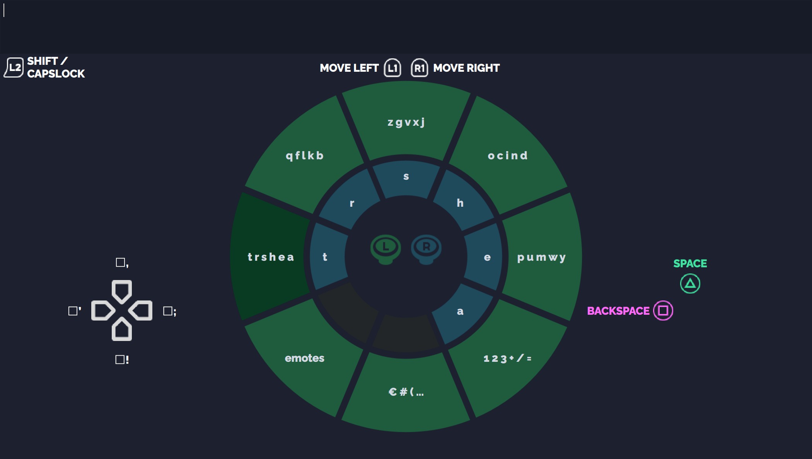

### Summary

- [What is GP4k](#what-is-gp4k)
- [How to use it](#how-to-use-it)
- [How does it work](#how-does-it-work)

# What is GP4k

GP4k stands for *GamePad to/2 Keyboard*. Actually, it's the fourth version of this project.  

GP4k is a proof of concept, aiming to demonstrate it's possible to offer a virtual circular keyboard using the two joysticks of a gamepad.

## Addressed issue

When typing text, the console displays a virtual QWERTY keyboard (*see Figure 1*) on the screen. The user moves the "selected key" to the desired letter using the left joystick and repeats this process for each letter. For example, typing "ZONE" can be tedious:

- Going to bottom left, press  "cross".
- Top right, press  "cross".
- Bottom right, press  "cross".
- Top left, press  "cross".
- And then the next letter.

[](https://en.wikipedia.org/wiki/File:KB_United_States.svg)

***Figure 1**: The QWERTY layout. Typing "ZONE" on a QWERTY keyboard requires 20 actions (16 movements and 4 presses on the "cross" button), depending on the chosen path.*

Not to mention that maintaining the stick until reaching the desired key can lead to pass it. GP4k demonstrates a concept that could be more comfortable, using "tiles" on the GUI (*See Figure 2*) and the controller's sticks.

A "tile" (the different blocs disposed as a circle, at the center of the GUI) is selected by pushing the stick to the border to set the angle, then releasing it: an unique move. A character is typed by selecting a "char group" with the left stick (outer disc, in green), then selecting the character with the right stick (inner disc, in blue): two moves, *voire* one if the correct char group is already selected from the previous character.

With GP4k, typing "ZONE" requires 7 moves... or 3 if using the auto-complete feature.



*Figure 2 - GP4k's GUI - GUI features an outer disc for group selection (green) and an inner disc for character selection (blue). Black tiles are used for auto-complete suggestions, which activate dynamically. The button's assets are from kenney's assets[1].*

## Scope

As a demonstration, GP4k does not tend to everything. The goals were:

- Implementing a working demonstration to type text with the joysticks;
- Proposing a user experience to improve the efficiency compared to the QWERTY layout.

Thus, some pertinent topics for such the concept are not addressed by the demonstration, and are "out of scope".

### "Accessibility" is out of scope

This proof of concept does not include accessibility features at runtime. While I believe this approach could enhance text-entry accessibility for many gamers, implementing such features is beyond the scope of this demonstration.

- Implementing remapping options at runtime do not improve the efficiency, so this is out of scope.
- There is as much "Accessibility User Experiences" as person requiring one, including features I do not imagine. As I'm not concerned by this need, I do not feel legitimate to propose one. 

However, accessibility was not forgotten during the development:

- The code is written to allow buttons remapping at compile time. See [Remapping the buttons](#remapping-the-buttons) section for details.

- The letters and numbers are limited to 6 tiles on 6 tiles groups, to keep the option to make a configuration using a 6x6 layout, that I think can contribute to accessibility by enlarging the angle range for a given tile from 45° to 60°. The trade of is renouncing to emotes and some special characters such as `{` or `&`:  They should be determined by concerned people to be as close as possible to their needs.

### "Typing in Kate" is out of scope

In Kate or any other text editor or text field of a computer. To do this, it would require to communicates directly with the OS using it's API. It's consequent additional work, while it doesn't contribute to the efficiency. This is also the reason why GP4k integrates its own Text Field, to keep all the circular keyboard tests in the same program.

# How to use it

## Running the demonstration

### On Linux

GP4k was developed and tested on Linux Kubuntu 24.04. To run the demonstration:

1) Install Qt 5.15.2.
2) Clone this repository.
3) Build and run the project.

### On Windows

GP4k uses the [`QGamepad class`](https://doc.qt.io/qt-5/qgamepad.html) to handle the controller, which rely on XInput for its back-end on Windows. On my side (Windows 11), this setup seems to face some issues, as it does not detect any gamepad changing the controller (Xbox one S controller, DualSense, Nintendo Switch Pro controller) and rechecking the most obvious elements (cable, drivers...) does not solve the issue. Thus, GP4k is not tested on Windows. Using the SDL instead was not an option: GP4k exclusively uses Qt for simplicity and consistency in demonstrating the concept. Adding SDL would increase complexity without directly enhancing the user experience. Please feel free to test on your side if you want to.

> I did not have the opportunity to try on Windows 10, but it could be a good answer. An other option would be to rework  QGamepad back-end to use the SDL instead of XInput. Any feedback or contribution are welcome about this, to make the demonstration accessible to the most.

## Configuring the demo

### Remapping the buttons

You can remap buttons in `/Headers/GP4k_ButtonsMapping.h`. Locate the section marked "User code starts here" (line 176). The association between physical buttons and the features are defined here. Please only modify the "two first columns", as explained by the comments.

```c++
 /*  								            These columns
 *    Excerpt of the original mapping     |-----------------------|
 *                                        |   FIRST      SECOND   |
 *                                        |-----------|-----------|           */
inline const PhysicalButton_t Button_X  ={{BACKSPACE , BACKSPACE  }, ColorsX, "X", LABEL_LEFT};
inline const PhysicalButton_t Button_Y  ={{SPACE     , SPACE      }, ColorsY, "Y", LABEL_TOP};
inline const PhysicalButton_t Button_LB ={{MOVE_LEFT , MOVE_LEFT  }, ColorsW, "LB", LABEL_LEFT};
inline const PhysicalButton_t Button_RB ={{MOVE_RIGHT, MOVE_RIGHT }, ColorsW, "RB", LABEL_RIGHT};
// -----------------------------------------------------------------------------------------

 /*  How it could be remapped. Only             These columns
 *    the two first columns should be     |-----------------------|
 *    modified. Note that this reamapping |   FIRST      SECOND   |
 *    is not a proposition.               |-----------|-----------|           */
inline const PhysicalButton_t Button_X  ={{MOVE_RIGHT , SPACE     }, ColorsX, "X", LABEL_LEFT};
inline const PhysicalButton_t Button_Y  ={{BACKSPACE  , MOVE_LEFT }, ColorsY, "Y", LABEL_TOP};
inline const PhysicalButton_t Button_LB ={{MOVE_RIGHT , BACKSPACE }, ColorsW, "LB", LABEL_LEFT};
inline const PhysicalButton_t Button_RB ={{SPACE      , MOVE_LEFT }, ColorsW, "RB", LABEL_RIGHT};
```


### Remapping the GUI

You can remap GUI in `/Headers/GP4k_GuiMapping.h` Locate the section marked "User code starts here" (at line 10). It offers options to:

- Resize the window: Change the value of `CELL_SIZE`. The GUI was designed using a "grid map" in Figma. CELL_SIZE is the size of a cell in this grid. All the sizes and positions in the project are expressed in `CELL_SIZE` units.
- Resize the font: Change the value of `GLOBAL_FONT_SIZE`. It's recommended to set it as a fraction of `CELL_SIZE` to resize the text with the window.
- Change the font: Change `GLOBAL_FONT` to the font of your taste. "Raleway" has been chosen to be as close as possible of Xbox letters on buttons, in upper case and semi-bold.

### Remapping the characters

You can remap characters in `/Headers/GP4k_TilesMapping.h`. Locate the section marked "User code starts here" (line 21). It offers options to define the characters of each inner tile, by modifying `InnerTilesChars`. `OuterTilesTexts` defines the texts displayed on each outer tile and should be redefined accordingly. `GroupsSuggestionsMap` defines the number of empty tiles for each inner tile group for auto-complete suggestions, and should be modified accordingly.

# How does it work

## Keyboard layout

> This section can be a bit technical. To summarize, it explains how the keyboard layout was decided. The goal was to arrange the letters to minimize the number of joystick movements needed during typing. To achieve this, I used a mathematical optimization technique to find an efficient layout based on English pairs-of-letters frequency. Please feel free to jump to [Auto-complete](#auto-complete) if you don't feel like reading this part.

The concept offered by GP4k is so different of traditional keyboard that simply reporting the QWERTY keys order to the GP4k tiles would not be pertinent. The layout should be determined to respect some constraints.

The article *AZERTY amélioré: computational design on a national scale*[2] is about offering a new Keyboard layout. It must conjugate users habits (i.e. keeping the AZERTY basis) with the French language specificities (such as `œ`) that are not possible on a "classic" AZERTY keyboard. Some of the constraints exposed by the researchers apply to GP4k:  

1) "time spent visually seeking a character should be minimized through, for example, [...] grouping characters that are considered similar."
2) The decision to place or not characters special characters (`#` or `§` as an example), and where, must be weighted by their usage in "proper" English and in a gaming context.

Another obvious constraint, related to GP4k itself, is where to place letters, one compared to the otters, to limit the need for "char group" switching.

### Grouping similar characters

The characters to place on GP4k's layout can be speared in five categories:

1) The letters
2) The "common special character" (`.` `,` `:` `;` `!` `?` `'` `-`)
3) The numbers
4) The special characters
5) The emotes (imposed by the gaming context)

The characters of a given category must be "at the same place": on the same char group or consecutive char groups. It has been arbitrarily decided to place the emotes on an unique char group, 7 remains available.

As mentioned earlier, the accessibility was kept in mind during development: Letters, punctuation, and numbers must be kept on 6 char groups, on 6 tiles per group, so users will keep the same layout for major characters, whether they use an eventual accessibility mode or not. The disposition on *Figure 3* was decided.

 

*Figure 3 - The organization decided for letters, punctuation and numbers  - To remain available even in an eventual "accessibility 6x6" layout a character must be at location $[g,i]_{g, i \in[0, 5]}$.*

This choice allows letters (in blue) to remain approximatively symmetric (*5x5 + 1*): contrarily to a *4x6 + 2*, it doesn't lead to have two letters isolated on a fifth group that could be underused. Then the switch between upper- and lower-case is done using the shift key (*See Figure 2*). Digits (yellow) are separated between 1 to 5 then 6 to 0, the switch is done using the shift key. It allows to keep them on the same tile group.

 The  "common special character" are considered too important not to remain available whatever the selected tile group is, so they are placed on the Dpad.

Finally, the "special characters" will be placed on all the G6 line, plus at G5T5, G5T6, and G5T7.

### Ordering the letters

Placing 26 letters on 26 tiles is a Quadratic Assignation Problem example. It's even mentioned on the [Wikipedia QAP page](https://en.wikipedia.org/wiki/Quadratic_assignment_problem#Applications)[3], and is actually used by the *AZERTY amélioré* reseachers[2]. to formulate the QAP, two matrix must be defined:

- The Distance matrix D, which entries are the distance between two tiles.
- the Flow matrix F, which entries are the probability to get two letters one after the other.

#### Defining the Distance matrix

Let $T(g,i))$ represent the tile on a group g (where $g \in [1, 5]$. Any further $g_x$ is defined on the same interval as $g$.) at index i (where $i \in [1, 6]$ for $g = 1$ or $i \in [1, 5]$ else. Any further $i_x$ is defined on the same interval as $i$).

Consider that:

> The distance between two tiles is the number of movements required to reach these two tiles. 

Within a group, the distance between two tiles $T(g, i1)$ and $T(g, i2)$ is defined as 1: Regardless of their relative position within a group, the user must perform a single movement from the center to the border of the left joystick. This is true even we the two consecutive tiles are the same.

The Distance Matrix within a group is defined as:


The distance between two tiles of two groups $T(g1, i1)$ and $T(g2, i2)$ is defined as 2: The user must perform a first movement with joystick left to select the group, then a second one with right joystick to select the tile.

The distance matrix between tiles of two different groups are defined as:


Note that, $\forall g_1, g_2 \in [2, 5], D_{g_1, g_2} = D_{g_2, g_1}$ and $C$ and $E$ are transposed.

Thus, The global Distance Matrix is bloc defined as :


Given that of $C$ and $E$ are transposed, and that $A$ and $B$ are symmetric, then D is a bloc symmetric and a symmetric matrix.

#### Defining the Flow matrix

In the fourteenth chapter of *Beautiful Data: The Stories Behind Elegant Data Solutions*[4], a bigram is defined as a sequence of two tokens - letters in this case. The sequences `ab` and `ba` are not the same, they are said directional so the English language contains 676 unique directional bigrams. It doesn't make the distinction between lower- and uper- case.

On its website, Peter Norvig offers the file count_2w.txt containing the counts of all these bigrams[5] (counted in the *Google's Trillion Word Corpus*). These counts will be used to fill the F matrix.

In English, the bigram `th` appears far more frequently than `ht` (about a factor 13). However, since each letter occupies a unique position on the keyboard layout, placing `T` and `H` on the same disc  because of `th`  will cancel the need the change the disc to type `H` then `T`: We can consider that bigrams directionality is not important for this problem. On data scope, we translate it by summing the directional frequencies of the bigrams `ab` and `ba`, and we note the resulting "non-directional" bigram `AB` (upper case, alphabetic order). This apply for all the available pairs of letter.

This study aims to arrange letters within tile discs to minimize the need for disc-switching during English text entry. Given that each letter is assigned a unique tile and that typing the same letter consecutively does not require a disc change, setting the symmetric non-directional bigrams `AA`, `BB`, etc., to zero is considered an acceptable approximation. Although this approach may lead to a minor loss of precision, it aligns with our primary objective by simplifying the model without compromising practical relevance.

The Flow Matrix $F$ is a $26 \times 26$ square matrix. The index $F_{\alpha,\beta}$ where $\alpha, \beta \in [1, 26]$ is the frequency of the non-directional bigram composed of the $\alpha^{th}$ and the $\beta^{th}$ Latin letter. Given how we defined the non-directional bigrams, $F$ is a symmetric matrix, and its diagonal is null.

#### Solving the QAP

The QAP is solved using a Genetic Algorithm (GA). GA uses random distributions to tend to an optimum, leading to different solutions each time the script is run. These solutions are associated to a cost equal to the sum of distances-flows products in the solution. While adjusting the GA parameters in an heuristic manner, the best solution offered a cost of 2.15e13.

In an attempt to minimize the impact of the randomness on the solution, the script solves the problem ten times (automatically determined seed for the random distributions) and stores ten solutions which cost is 2.15e13. To determine a consensual solution, the script affects a letter to the position it occurs the more often. the retained solution is:

```python
"t", "r", "s", "h", "e", "a"
"q", "f", "l", "k", "b"
"z", "g", "v", "x", "j"
"o", "c", "i", "n", "d"
"p", "u", "m", "w", "y"
```

Even with this method, the solutions are not the same at each run, so this layout is likely not definitive.

### Affecting the "common special character"

There is 8 punctuations to affect on 4 tiles: `.` `,` `:` `;` `!` `?` `'` `-`. They are affected by pairs:

- the period `.` and the comma `,` are used the mark pauses in a sentence.
- The apostrophe `'` and the hyphen `-` are used for word connections ("high-tech") and contractions ("he's").
- The exclamation mark `!` and the question mark `?` are used to indicates that a sentence is something else than the affirmative.
- The colon `:` and the semi-colon `;`.

These pairs are affected to the DPad as it (see *Figure 2*).

### Other special characters

There is 11 remaining tiles for special characters. 22 characters (using the shift key) :

`+`, `/`, `=`, `€`, `#`, `%`, `&`, `(`, `[`, `{`, `<`, `$`, `@`, `^`, `_`, `)`, `]`, `}`, `>`, `"`, `\`, `*`.

The selection was based on what I estimated pertinent: It excludes some characters I don't see often in chats, texts, or social medias: `§`, `¤`, `œ`...

The characters forming obvious "opening-closing" pairs (as parenthesis) are associated on the same tile using  the shift key. Remaining special characters were placed without more reflexion.

### Suggestions for auto-complete

There is 14 remaining tiles: They are all affected to auto-complete suggestions. These choices allow to have one suggestion tile on groups G2, G3, G4, and G5, at tile T5. The final result is visible on *figure 2*. 

## Auto-complete

The auto-complete is implemented using a trie[6]. Please see `Sources/Trie.cpp` and `Headers/Trie.h` for commented implementation.

### Dictionary

The suggestions are emitted by comparing the beginning of a word, the "prefix", to a trie containing words. The word of the trie are contained in `/Resources/trie_word_list.txt`. It's generated using scripts in `Python/Generating_Trie_Dictionary/`. The references for the words are: 

- The BNC "Rank frequency order: written English" list[7] for words without contractions or hyphen (treated by the scrips to remove unwanted entries).

- The Wikipedia list of English contractions[8].

- Some words absent from these lists that I tried to type during tests.


# References

[1] [Kenney's assets](https://kenney.nl/assets/input-prompts)

[2] [AZERTY amélioré: computational design on a national scale](https://dl.acm.org/doi/10.1145/3382035)

[3] [Wikipedia QAP page](https://en.wikipedia.org/wiki/Quadratic_assignment_problem#Applications)

[4] [Beautiful data](https://www.amazon.com/Beautiful-Data-Stories-Elegant-Solutions/dp/0596157118)

[5] [The Norvig's web page listing the bigrams](https://norvig.com/ngrams/)

[6] [Auto-complete feature using trie, on GeekForGeeks](https://www.geeksforgeeks.org/auto-complete-feature-using-trie/)

[7] [British National Corpus word lists](https://ucrel.lancs.ac.uk/bncfreq/flists.html)

[8] [Wikipedia English contractions list](https://en.wikipedia.org/wiki/Wikipedia:List_of_English_contractions)

